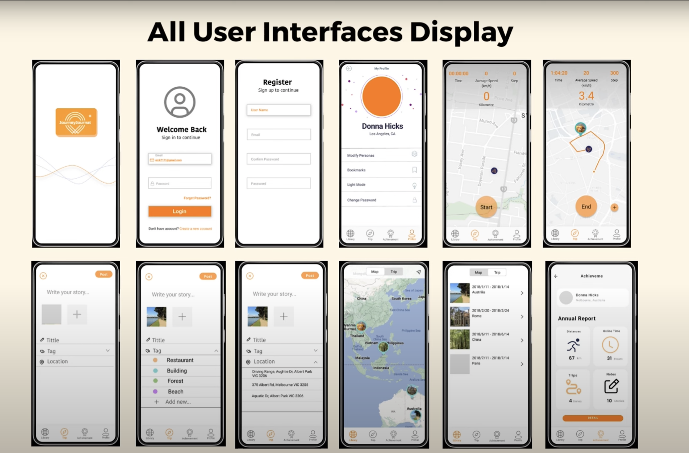

# Journey-journal
## This repository contains the code for Android app contributed by the repositroy owner and four other team members.

# Tools:
- Java, XML, Android Studio
- Google Map, Firebase

# UI:

## Table of Contents
- [Login/Register](#login/registe)
- [Trip](#trip)
- [Achievement](#achievement)
- [Profile](#profile)
- [Library](#library)

## Login/Register
This app uses Camera and GPS sensors to record text, images and route of a trip. 

Historical trip records are displayed in Library, where user can track their historical records. 
Achievement page consists of the data visulalisation of the records in Day, Week and Month range. 
User are able to customise avatar, username and trip tags in Profile page. 

- Login

## Trip

- After Start a trip, you can add diary...

- After Ending a trip 

## Achievement
- Data visualisation of records

## Profile
- Edit username, avatar and trip tags 

## Library
- Map with historical trip records representing in markers (clickable, redirect to corresponding trip record)

- Historical trip records in list

